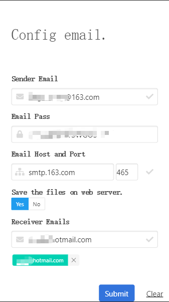
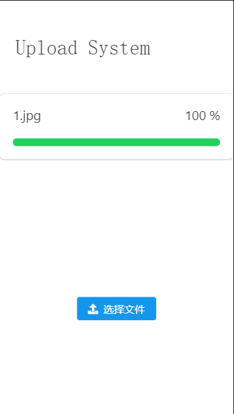
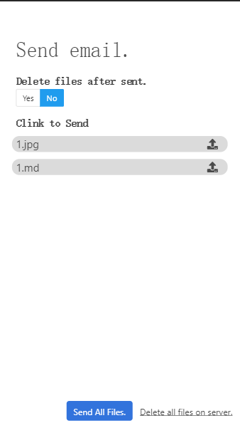
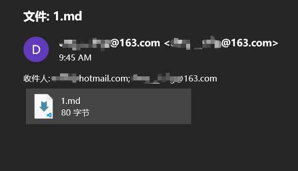

## 手机上传文件后, 自动发送到指点邮箱

### 使用方法
1. 打开配置页面配置
    - `save the files on the web server`
        - YES: 不直接发送而是将文件保存在web 服务器上, 上传完文件后需要打开发送页面发送
        - NO: 直接发送到指定邮件
2. 打开上传页面上传文件
### 配置页面
- `/config`
- 

### 上传页面
- `/`, `/upload`
- 

### 发送页面
- `/send`
- 
### 邮件内容
-  